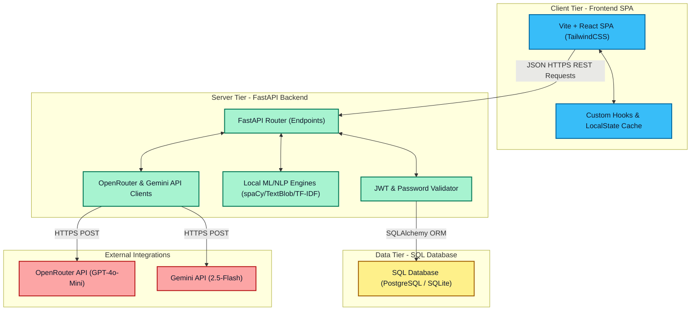
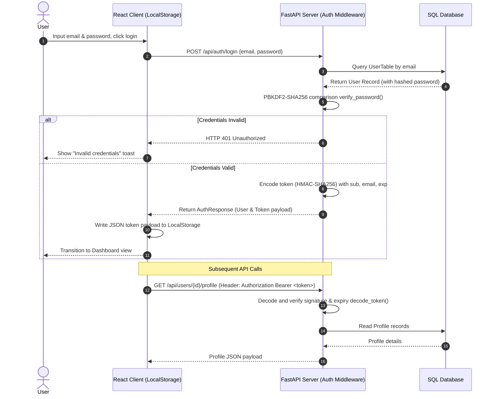
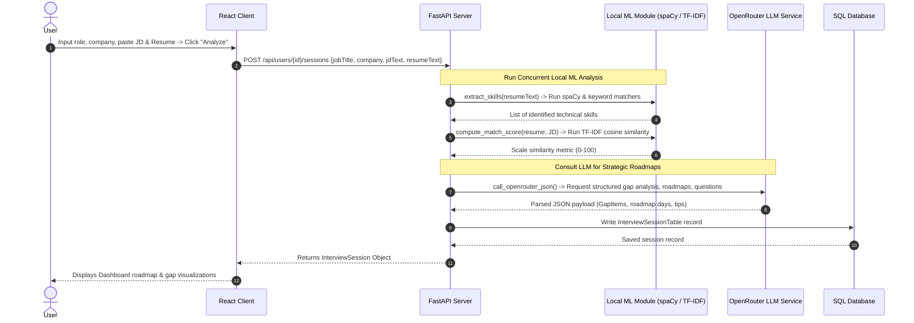
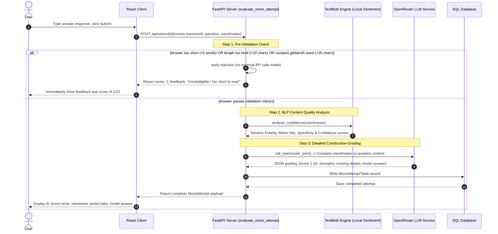

# PrepIQ System Architecture & Developer Documentation

Welcome to the **PrepIQ** developer documentation. This document is a comprehensive guide to the system architecture, technology stack, directory organization, database schema, and major data flows of the application. It is designed to help new contributors ramp up quickly.

---

## 1. Tech Stack Summary

PrepIQ is built as a modern, decoupled web application featuring a fast and responsive React frontend, a high-performance Python FastAPI backend, and local ML / external LLM integrations for intelligent assessment.

### Frontend
- **Framework & Build Tool**: React 18, TypeScript, Vite
- **Styling & Theme**: TailwindCSS, Radix UI Primitives (via shadcn/ui), `next-themes` (Dark/Light mode support)
- **Routing**: React Router DOM (v6)
- **State & Sync**: Custom React hooks with dynamic `localStorage` caching and React Query (`@tanstack/react-query`)
- **Icons**: Lucide React

### Backend
- **Core Framework**: FastAPI (Asynchronous Python web framework)
- **ASGI Server**: Uvicorn
- **Database ORM**: SQLAlchemy (Declarative mapping)
- **Database Engine**: PostgreSQL (via `psycopg` in production) / SQLite (for local test development)
- **Authentication**: JWT (JSON Web Tokens) with Custom HMAC-SHA256 signing and PBKDF2-SHA256 password hashing

### Machine Learning & NLP
- **Entity & Skill Extraction**: spaCy (`en_core_web_sm` model) + Custom keyword matching algorithm
- **Relevance Scoring**: Scikit-Learn TF-IDF Vectorizer + Cosine Similarity matching
- **Sentiment & Analysis**: TextBlob NLP for sentence polarity, word counts, and structural confidence analysis
- **Generative AI Integration**: OpenRouter API (`openai/gpt-4o-mini` default model) / Gemini API (`gemini-2.5-flash` fallback model) for gap analysis, prep roadmaps, interview questions, and feedback evaluation

---

## 2. High-Level System Architecture

PrepIQ follows a modern Client-Server architectural pattern. The Single Page Application (SPA) frontend communicates with the FastAPI backend over secure asynchronous HTTP REST APIs. External integrations are kept isolated within backend service layers.



---

## 3. Frontend Architecture

### Directory Structure
```text
src/
├── components/          # Reusable UI elements and app layout
│   ├── AppLayout.tsx    # Overall application viewport layout
│   ├── AppSidebar.tsx   # Left hand sidebar navigation options
│   ├── ui/              # Atom level shadcn/ui custom components (Buttons, Cards, Dialogs, etc.)
│   └── TagInput.tsx     # Specialized Tag Input component
├── pages/               # High-level Views mapped to routes
│   ├── Index.tsx        # Public landing/index router entrypoint
│   ├── AuthPage.tsx     # Unified Login/Signup view
│   ├── OnboardingPage.tsx # Step-by-step career path questionnaire
│   ├── DashboardPage.tsx # Core prep and tracker control center
│   ├── CareerDNAPage.tsx # Profile, skill logs, and fear trackers
│   ├── InterviewPrepPage.tsx # Session manager (Resume upload, JD match, and AI gap roadmap)
│   ├── MockInterviewPage.tsx # Interactive, score-driven practice simulator
│   ├── JobTrackerPage.tsx  # Interactive Kanban board for application tracking
│   ├── ProgressPage.tsx  # AI evaluations dashboard and diagnostic history
│   └── NotFound.tsx     # Generic fallback 404 page
├── lib/                 # Core helper modules
│   ├── api.ts           # Standard fetch-based wrapper for authenticated REST API requests
│   └── store.ts         # Centralized React hooks synchronizing token-based local stores
├── hooks/               # Core utility hook extensions
└── main.tsx             # DOM entry point
```

### Component Navigation & Routing Trees
All authenticated views are wrapped inside a common `<AppLayout>` layout utilizing `<AppSidebar>` for routing options. Unauthenticated visitors are redirected directly to `/login`.

```text
/ (Index.tsx) -> Public landing
├── /login (AuthPage.tsx) -> Authentication form
├── /signup (AuthPage.tsx) -> Registration form
└── /onboarding (OnboardingPage.tsx) -> Forced multi-step profile builder
    
Protected Workspace (wrapped with AppLayout):
├── /dashboard (DashboardPage.tsx) -> Performance Overview, Activity logs, Quick actions
├── /career-dna (CareerDNAPage.tsx) -> Skills analyzer, Certifications, Fear notes
├── /interview-prep (InterviewPrepPage.tsx) -> Gap analysis creator, Resume/JD match
├── /mock-interview (MockInterviewPage.tsx) -> AI simulator, early gibberish checker, scoring view
├── /job-tracker (JobTrackerPage.tsx) -> Job listing tracker (Kanban UI)
└── /progress (ProgressPage.tsx) -> Deep-dive attempt analytics and feedback history
```

---

## 4. Database Schema Overview

PrepIQ uses an ORM-managed schema built with `SQLAlchemy`. Database columns utilize JSON serialization to store complex nested configurations (like roadmap days, gap structures, work history lists, and skill arrays) inside single rows for fast querying and lightweight maintenance.

```mermaid
erDiagram
    USERS {
        string id PK "UUID-36"
        string name "Full Name"
        string email UK "Indexed"
        string password_hash "PBKDF2 Hash"
        datetime created_at "UTC Timestamp"
    }

    PROFILES {
        string user_id PK "UUID-36, matches USERS.id"
        string full_name
        string email
        json target_roles "Array of strings"
        json dream_companies "Array of strings"
        string degree
        string institution
        string graduation_year
        string coursework
        json certifications "Array of strings"
        json work_history "Array of Work Objects"
        json technical_skills "Array of Skill Objects"
        json soft_skills "Array of strings"
        json interview_fears "Array of strings"
        string fear_notes
        boolean onboarding_complete
        datetime updated_at
    }

    INTERVIEW_SESSIONS {
        string id PK "UUID-36"
        string user_id FK "Indexed"
        string job_title
        string company
        string jd_text
        string resume_text
        json gap_analysis "Skill Gap objects"
        int readiness_score "0 to 100"
        json question_bank "Custom generated questions"
        json roadmap "5-day study plan"
        json extracted_skills "Skills pulled by NLP parser"
        int ml_match_score "TF-IDF Match score"
        datetime created_at
    }

    MOCK_ATTEMPTS {
        string id PK "UUID-36"
        string session_id FK "Empty or associated INTERVIEW_SESSIONS.id"
        string user_id FK "Indexed"
        string question "Evaluated question text"
        string user_answer "Submitted answer"
        int ai_score "1 to 10 score"
        json ai_feedback "Strengths, weaknesses, model answer"
        datetime created_at
    }

    JOB_APPLICATIONS {
        string id PK "UUID-36"
        string user_id FK "Indexed"
        string company_name
        string job_title
        string job_url
        string date_applied "YYYY-MM-DD"
        string status "Applied | Screening | Interview | Offer | Rejected | Ghosted"
        string salary_range
        string location
        string notes
        string resume_used
        string contact_person
        string next_action
        string next_action_date
        string linked_prep_session_id FK "Associated INTERVIEW_SESSIONS.id"
        datetime created_at
        datetime updated_at
    }

    USERS ||--|| PROFILES : "has profile"
    USERS ||--o{ INTERVIEW_SESSIONS : "creates"
    USERS ||--o{ MOCK_ATTEMPTS : "completes"
    USERS ||--o{ JOB_APPLICATIONS : "tracks"
    INTERVIEW_SESSIONS ||--o{ MOCK_ATTEMPTS : "contains (optional)"
    INTERVIEW_SESSIONS ||--o{ JOB_APPLICATIONS : "linked to (optional)"
```



---

## 5. Backend API Reference

All protected API endpoints require an `Authorization` header containing the JWT token: `Bearer <token>`.

### Authentication
- `POST /api/auth/signup`
  - **Description**: Registers a new user.
  - **Payload**: `{ name, email, password }`
  - **Response**: `{ user: { id, name, email }, token }`
- `POST /api/auth/login`
  - **Description**: Authenticates user credentials.
  - **Payload**: `{ email, password }`
  - **Response**: `{ user: { id, name, email }, token }`
- `GET /api/auth/me`
  - **Description**: Verifies and decodes the JWT token.
  - **Response**: `{ id, name, email }`

### Career Profiles
- `GET /api/users/{user_id}/profile`
  - **Description**: Retrieves the user's career profile.
- `PUT /api/users/{user_id}/profile`
  - **Description**: Updates or initializes the user's career profile.
  - **Payload**: `CareerProfile` JSON object.

### Interview Prep Sessions
- `GET /api/users/{user_id}/sessions`
  - **Description**: Retrieves a list of all active prep sessions.
- `GET /api/users/{user_id}/sessions/{session_id}`
  - **Description**: Retrieves details for a specific session (including gap roadmap).
- `POST /api/users/{user_id}/sessions`
  - **Description**: Initiates a new prep session. Triggers local skill extraction (spaCy), similarity matching (TF-IDF), and LLM generation (gap analysis, study roadmap, question bank).
  - **Payload**: `{ jobTitle, company, jdText, resumeText }`
- `DELETE /api/users/{user_id}/sessions/{session_id}`
  - **Description**: Deletes a session and cascading mock attempts.

### Mock Interviews & AI Simulator
- `GET /api/users/{user_id}/mocks`
  - **Description**: Retrieves paginated history of mock attempts.
  - **Query Params**: `limit` (default 20), `offset` (default 0).
- `POST /api/users/{user_id}/mocks`
  - **Description**: Submits an interview answer for AI evaluation. Performs early pre-validation checking for gibberish/short replies before calling TextBlob and OpenRouter LLM.
  - **Payload**: `{ sessionId, question, userAnswer }`
  - **Response**: `MockAttempt` (with score and detailed strengths/missing points).
- `POST /api/users/{user_id}/mock/generate-question`
  - **Description**: Generates a single role + difficulty technical/behavioral interview question.
  - **Payload**: `{ role, difficulty }`

### Job Tracker
- `GET /api/users/{user_id}/jobs`
  - **Description**: Lists all job applications.
- `POST /api/users/{user_id}/jobs`
  - **Description**: Commences tracking a new job application.
  - **Payload**: `{ companyName, jobTitle, jobUrl, status }`
- `PATCH /api/users/{user_id}/jobs/{job_id}`
  - **Description**: Modifies status, salary, notes, or next action details of a tracked job.
  - **Payload**: `Partial<JobApplication>`
- `DELETE /api/users/{user_id}/jobs/{job_id}`
  - **Description**: Removes a job application.

### Natural Language Processing (Local ML)
- `POST /api/ml/extract-skills`
  - **Description**: Extracts technical skill entities from text.
- `POST /api/ml/match-score`
  - **Description**: Measures cosine similarity matching score between a resume and JD.
- `POST /api/ml/analyze-confidence`
  - **Description**: Measures text polarity, word count, specificity index, and structural confidence score.

---

## 6. System Data Flows

### A. Authentication Flow
This diagram illustrates the login process and how security tokens are propagated and validated for subsequent API access.



---

### B. Session Creation & Analysis Flow
This flow tracks the processing pipeline that occurs when a user initiates a new interview prep session.



---

### C. Mock Interview Attempt & Evaluation Flow
This diagram details the early pre-validation safety block and the multi-tiered evaluation pipeline triggered by submitting an answer.



---

## 7. Onboarding & Contributing Guidelines

### Local Development Setup
1. **Clone the Repository**:
   ```bash
   git clone https://github.com/Aashikhandelwal05/PrepIQ.git
   cd PrepIQ
   ```

2. **Backend Setup**:
   - Create a virtual environment and activate it:
     ```bash
     python -m venv venv
     # Windows:
     .\venv\Scripts\activate
     # macOS/Linux:
     source venv/bin/activate
     ```
   - Install dependencies:
     ```bash
     pip install -r backend/requirements.txt
     ```
   - Configure local environment variables by copying `.env.example` to `.env` in the root and specifying values like `APP_SECRET` and `OPENROUTER_API_KEY`.
   - Start the FastAPI dev server:
     ```bash
     python -m uvicorn backend.app.main:app --reload --port 8000
     ```

3. **Frontend Setup**:
   - Install packages:
     ```bash
     npm install
     ```
   - Start the Vite development build server:
     ```bash
     npm run dev
     ```

4. **Running Tests**:
   Ensure everything works perfectly:
   ```bash
   python -m pytest backend/tests/test_api.py
   ```

### Code Style Guidelines
- **Python**: Enforce formatting using `ruff`. Run `ruff check` and `ruff format` prior to staging files. Ensure type definitions are strictly annotated across all model conversion mappings.
- **TypeScript/React**: Leverage modern functional components, standard hooks, and strict TS interfaces. Build atomic layout models before detailing page modules.
