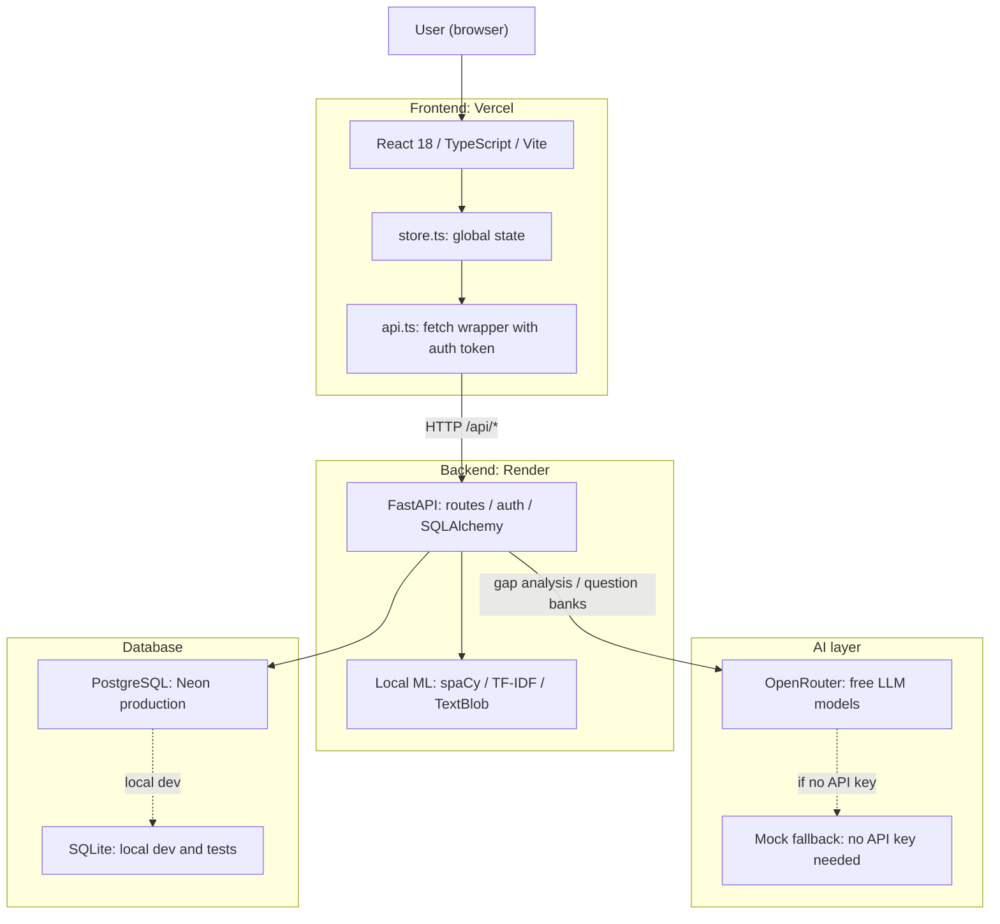

# PrepIQ Architecture Overview

This document gives new contributors a quick map of how PrepIQ is structured and how its parts connect.

## System Diagram

## How the parts fit together

### Frontend: React + Vite (Vercel)

A single-page React app written in TypeScript. All pages live under `src/pages/`, reusable components under `src/components/`. Every HTTP call goes through `src/lib/api.ts`, which automatically injects the auth token. Global state and data-fetching logic live in `src/lib/store.ts`.

> In local development, Vite proxies all `/api` requests to `localhost:8000` automatically. No manual URL configuration needed. Only set `VITE_API_BASE_URL` when deploying to a separate host like Vercel.

### Backend: FastAPI (Render)

All routes, authentication, database access, and AI integration live in `backend/app/main.py`. Local ML/NLP logic is isolated in `backend/app/ml.py` and runs entirely on your machine without any external API key.

Authentication uses HMAC-signed bearer tokens. Passwords are hashed with PBKDF2.

### Database: PostgreSQL via Neon (SQLite for local dev)

Production uses a managed Neon PostgreSQL instance. Tests also use SQLite so no external database is needed to run them.

> For local development, set `DATABASE_URL=sqlite:///./backend/local.db` in your `.env` file. Copy `.env.example` to get started.

### AI: OpenRouter (with mock fallback)

AI features (gap analysis, question banks, study roadmaps, mock interview scoring) use OpenRouter.

> If `OPENROUTER_API_KEY` is not set, the backend automatically falls back to built-in mock responses. All features work locally without an API key.

### Local ML / NLP (no API key required)

| Model | Purpose |
| :--- | :--- |
| spaCy NER | Extract skills from resume or job description text |
| scikit-learn TF-IDF | Cosine similarity between resume and job description |
| TextBlob | Sentiment and confidence scoring for interview answers |

> If NLP model assets are not installed, these features fall back to keyword matching and the app still works. Install them with `python -m spacy download en_core_web_sm` and `python -m textblob.download_corpora`.

## Request flow example: creating a prep session

1. User clicks "Create Session" in `InterviewPrepPage.tsx`
2. `store.ts` calls `api.ts` with the auth token attached
3. Request hits the prep session creation route on FastAPI (see `backend/app/main.py` for the exact path)
4. FastAPI validates the token and reads the user profile from PostgreSQL
5. Backend sends a prompt to OpenRouter for gap analysis and question generation
6. OpenRouter returns the AI response (or mock fallback is used)
7. Result is saved to the database and returned to the frontend
8. `store.ts` updates global state and the UI re-renders

## Key files for new contributors

| File | What it does |
| :--- | :--- |
| `backend/app/main.py` | All FastAPI routes, models, and AI logic |
| `backend/app/ml.py` | Local ML: spaCy, TF-IDF, TextBlob |
| `src/lib/api.ts` | Frontend HTTP client with auth token injection |
| `src/lib/store.ts` | Global state and data-fetching hooks |
| `src/pages/` | One file per page or feature |
| `src/components/ui/` | 49 reusable shadcn/ui components |
| `docker-compose.yml` | Run the full stack locally with one command |
| `.env.example` | Template for all required environment variables |
